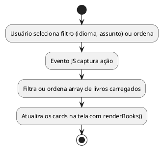
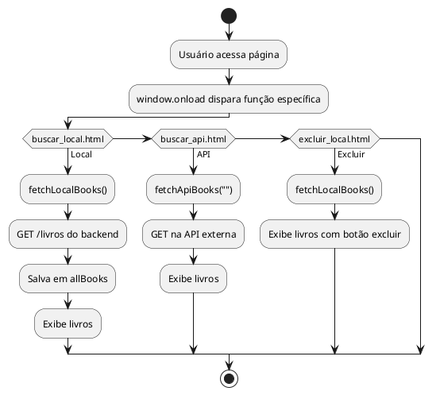
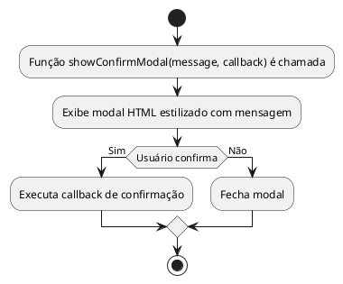
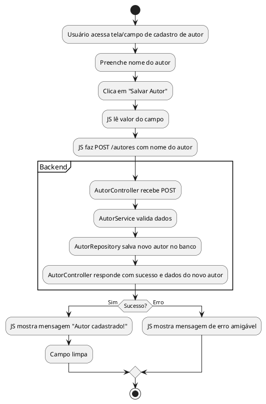
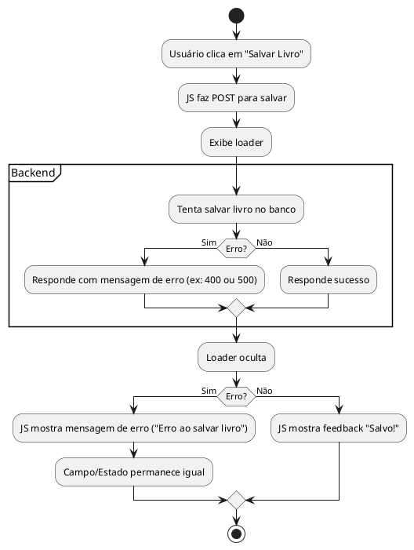
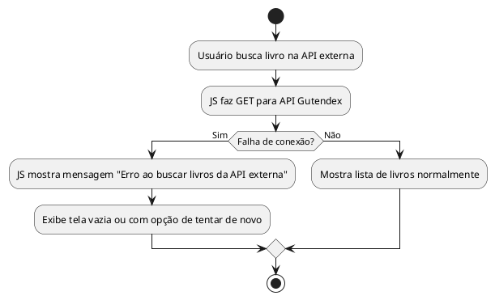
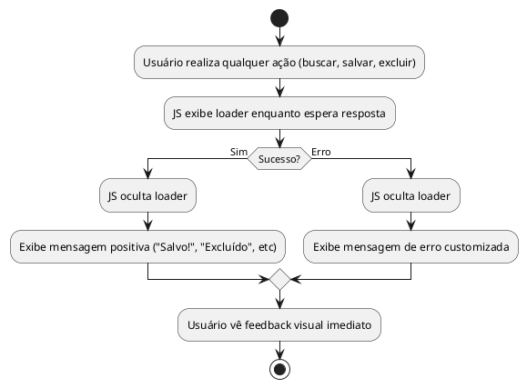
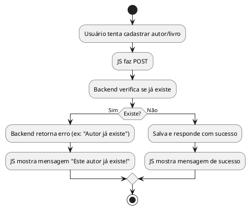
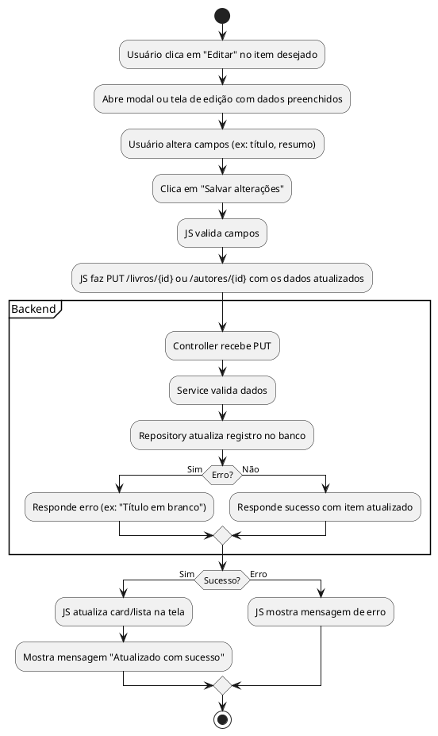
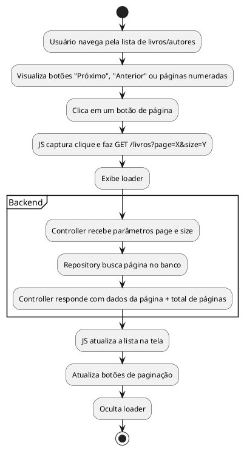

# Book Affix — Documentação

## **Sumário**

* [1. Visão geral do sistema](#visao-geral)
* [2. Diagrama de Classes (backend)](#diagrama-classes-backend)
* [3. Diagrama de Classes (frontend)](#diagrama-classes-frontend)
* [4. Diagrama de Componentes](#diagrama-componentes)
* [5. Diagrama ER (Entidade-Relacionamento)](#diagrama-er)
* [6. Diagrama de Sequência (fluxo de exclusão)](#diagrama-sequencia)
* [7. Fluxos detalhados: buscar, salvar, excluir, editar, cadastro, tratamento de erro, login, paginação](#fluxos-detalhados)
* [8. Observações finais](#observacoes-finais)

---

<a name="visao-geral"></a>

## **1. Visão geral do sistema**

O **Book Affix** é um sistema completo para gerenciar livros e autores, oferecendo:

* Cadastro, consulta, edição e exclusão de livros e autores locais
* Busca e importação de livros diretamente da API externa Gutendex
* Interface web amigável e organizada
* Backend robusto (Spring Boot, Java) com todas as operações REST necessárias
* Frontend HTML+JS modular, organizado e com feedback visual

O sistema foi desenhado para ser extensível, seguro, performático e fácil de usar.

---

<a name="diagrama-classes-backend"></a>

## **2. Diagrama de Classes — Backend (Java)**


---

<a name="diagrama-classes-frontend"></a>

## **3. Diagrama de Classes — Frontend (JavaScript)**


---

<a name="diagrama-componentes"></a>

## **4. Diagrama de Componentes (Visão Alto Nível)**


---

<a name="diagrama-er"></a>

## **5. Diagrama ER (Entidade-Relacionamento Simplificado)**


---

<a name="diagrama-sequencia"></a>

## **6. Diagrama de Sequência — Exemplo: Exclusão de Livro**


---

<a name="fluxos-detalhados"></a>

## **7. Fluxos detalhados do sistema**

Todos os processos centrais do Book Affix ilustrados com diagramas e descritos em etapas claras:

---

### **7.1 Salvar Livro da API Externa no Sistema**


**Passo a passo:**

1. O usuário encontra um livro na busca da API externa.
2. Clica em "Salvar no sistema".
3. O frontend envia o pedido para o backend, que busca detalhes na Gutendex, salva no banco local, responde OK.
4. O botão desabilita e o usuário vê que o livro está seguro.

---

### **7.2 Buscar Livro por Título (Local e API Externa)**

#### **No banco local**


#### **Na API externa**


**Passo a passo:**

* Digite e busque: o filtro roda localmente se for livro do sistema, ou consulta a API externa via JS se for busca online. O resultado é exibido imediatamente.

---

### **7.3 Exclusão de Livro do Sistema**


**Passo a passo:**

* Clicou em excluir, confirmou no modal, JS faz o pedido de remoção. Backend exclui e frontend remove da tela.

---

### **7.4 Filtrar ou Ordenar Livros**



* Os filtros e ordenações rodam **sempre no navegador**: não há recarregamento do backend.

---

### **7.5 Inicialização da Página**



* Carregamento automático conforme o contexto de cada página.

---

### **7.6 Modal de Confirmação Customizada**



* Utilizado em toda ação sensível (exclusão, etc), garantindo UX profissional.

---

### **7.7 Cadastro de Autor**



---

### **7.8 Tratamento de Erro ao Salvar Livro**



---

### **7.9 Erro de Rede (API Externa offline)**



---

### **7.10 Feedback Visual e Mensagens**



---

### **7.11 Cadastro Duplicado (Autor ou Livro já existe)**



---

### **7.12 Edição/Atualização (Editar Livro ou Autor)**



---

### **7.13 Paginação de Resultados**



---

### **7.14 Login/Autenticação**

```plantuml
@startuml
start
:Usuário acessa tela de login;
:Preenche usuário e senha;
:Clica em "Entrar";
:JS faz POST /login com credenciais;
:Exibe loader;
partition Backend {
  :Controller recebe POST;
  :Service valida credenciais;
  if (Corretas?) then (Sim)
    :Gera token/session e responde sucesso;
  else (Não)
    :Responde erro ("Usuário ou senha inválidos");
endif
}
if (Sucesso?) then (Sim)
\:JS armazena token/session (ex: localStorage);
\:Redireciona usuário para a aplicação;
else (Erro)
\:JS mostra mensagem de erro;
endif
stop
@enduml

```

---

<a name="observacoes-finais"></a>
## **8. Observações finais**

- **Todas as ações do usuário** possuem retorno visual imediato.
- **Toda lógica de dados sensível** está protegida no backend, via services e validações.
- **Diálogos modais** para confirmação deixam o uso mais seguro e profissional.
- **Os diagramas acima** cobrem todos os fluxos essenciais, facilitando manutenção, auditoria e evolução do sistema.
- **Todo o código JS é modular**, organizado por responsabilidade, e pode ser facilmente expandido.
